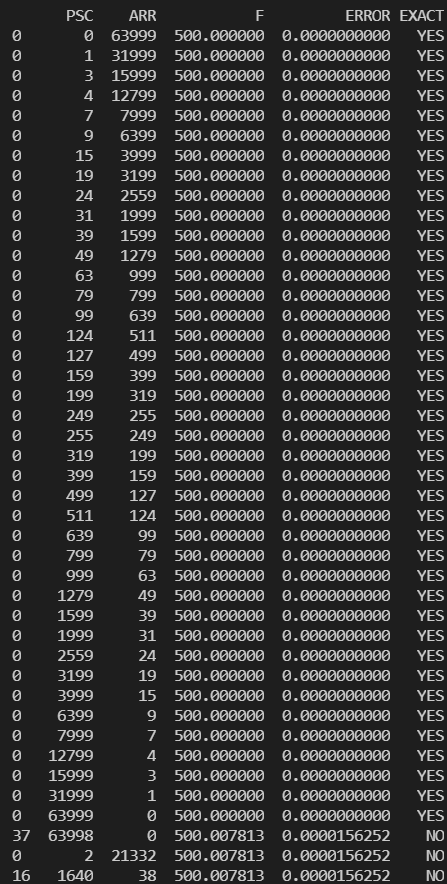

# Timer-calculator-for-MCUs

# Description
Select your 
1. TARGET_F = 500  # In Hz so 50.0 is 0.020 seconds period and 0.25 is 4 seconds period
2. CLOCK_MCU = 32000000
3. TOLERANCE = 0.0001
to plot your timer register configuration.

### Tested with STM32 microcontrollers

